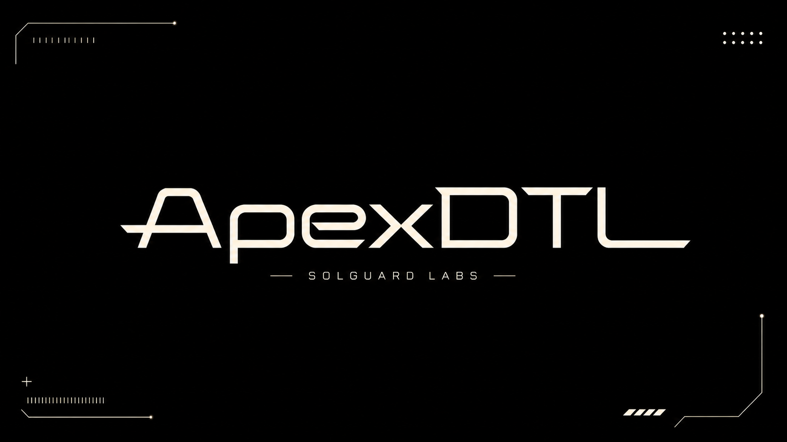
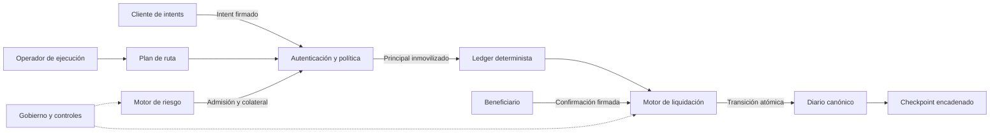
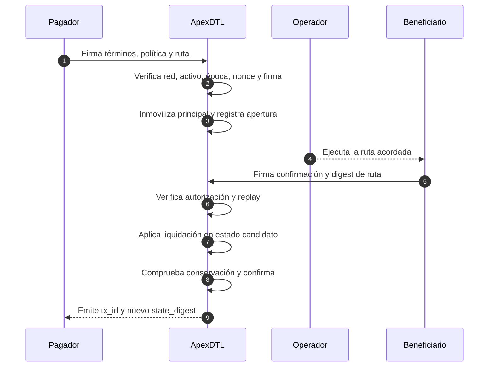

# ApexDTL

[](https://github.com/SolguardLabs/ApexDTL/actions/workflows/ci.yml)
[](https://github.com/SolguardLabs/ApexDTL/tree/production)
[](https://www.rust-lang.org/)
[](https://github.com/SolguardLabs/ApexDTL/releases)
[](./LICENSE)

ApexDTL es un motor determinista de intents para coordinar pagos entre redes,
corredores de liquidez y operadores de ejecución. Su núcleo en Rust autentica
las órdenes, inmoviliza el principal, valida la ruta observada y contabiliza la
liquidación como una transición atómica y reproducible.

El protocolo incorpora admisión por riesgo, precio ajustado por utilización,
gobierno con quorum y timelock, límites móviles de flujo y checkpoints
encadenados. La salida JSON del CLI permite integrar simuladores, observadores y
procesos de conciliación sin depender de estado implícito.

## Capacidades

- Firmas Ed25519 separadas por dominio para apertura y liquidación.
- Serialización canónica y digests BLAKE3 para órdenes, rutas y estado.
- Nonces independientes, rechazo de replay e identificación determinista.
- Ventanas temporales monotónicas y enlace estricto con el venue autorizado.
- Contabilidad transaccional con verificación de conservación del suministro.
- Scoring ponderado, concentración posterior y colateral por banda de riesgo.
- Curva de comisión con kink, coste de liquidez y pérdida esperada.
- Gobierno ponderado con quorum, timelock, guardian y executor separados.
- Límites por operación y por ventana, con modos normal, restringido y detenido.
- Checkpoints que comprometen estado, diario, época, versión y predecesor.

## Arquitectura



| Dominio | Responsabilidad | Módulo |
| --- | --- | --- |
| Identidad | Claves, cuentas, firmas y dominios | `src/crypto`, `src/codec` |
| Orden | Política, términos, ruta y autorización | `src/order` |
| Estado | Saldos, intents, diario e invariantes | `src/ledger` |
| Riesgo | Scoring, concentración y colateral | `src/risk.rs` |
| Economía | Precio, pérdida esperada y margen | `src/economics.rs` |
| Gobierno | Quorum, timelock y separación de roles | `src/governance.rs` |
| Operación | Límites móviles y modos de control | `src/controls.rs` |
| Evidencia | Checkpoints y escenarios reproducibles | `src/checkpoint.rs`, `src/runtime` |

## Ciclo de una orden



La mutación se calcula sobre una copia candidata. Si cualquier operación
aritmética, firma, nonce, digest o invariante falla, el estado original permanece
intacto.

## Modelo económico

La admisión combina señales normalizadas en basis points:

```text
score = 0,25·finalidad + 0,20·liquidez + 0,35·contraparte + 0,20·operación
concentración_post = (exposición_corredor + principal) / (cartera + principal)
colateral_requerido = principal · max(mínimo_corredor, mínimo_banda)
```

El precio separa los componentes que deben observar Operaciones y Riesgos:

```text
fee_bps = min(fee_base + prima_utilización + prima_finalidad + prima_riesgo, fee_máxima)
pérdida_esperada = principal · probabilidad_pérdida · severidad
margen_contribución = comisión_protocolo - pérdida_esperada - coste_liquidez
```

La curva de utilización cambia de pendiente al alcanzar el kink configurado. El
CLI `quote` expone el desglose y un digest de cotización reproducible. El modelo
completo y un ejemplo numérico están en [docs/modelo-economico.md](./docs/modelo-economico.md).

## Inicio rápido

Requisitos:

- Rust `1.96.0` o superior.
- Bun `1.3.0` o superior.
- Node.js `24` para validación de sintaxis y tooling.

```bash
git clone https://github.com/SolguardLabs/ApexDTL.git
cd ApexDTL
bun install --frozen-lockfile
cargo build --all-targets --locked
cargo run --locked -- routed
```

El comando devuelve JSON estable. Escenarios disponibles:

```bash
cargo run --locked -- direct
cargo run --locked -- routed
cargo run --locked -- batch
cargo run --locked -- snapshot
cargo run --locked -- quote
cargo run --locked -- checkpoint
cargo run --locked -- version
```

## Ejemplo de integración

```rust
use apex_dtl::{
    Amount, Bps, EconomicInputs, FeeCurve, PricingEngine,
};

fn main() -> Result<(), Box<dyn std::error::Error>> {
    let engine = PricingEngine::new(FeeCurve::default())?;
    let quote = engine.quote(EconomicInputs {
        principal: Amount::new(10_000_000)?,
        utilization_bps: Bps::new(9_000)?,
        finality_epochs: 6,
        loss_probability_ppm: 2_000,
        loss_severity_bps: Bps::new(4_000)?,
        risk_score_bps: Bps::new(4_000)?,
    })?;

    println!("{}", serde_json::to_string_pretty(&quote)?);
    Ok(())
}
```

## Validación

```bash
# Linux or macOS
bash scripts/ci.sh

# PowerShell
./scripts/ci.ps1
```

El pipeline valida formato, build, Clippy con warnings como errores, tests Rust,
contratos CLI en Bun y alineación de versión en los tags. CI ejecuta Rust 1.96 y
el canal estable para detectar incompatibilidades de MSRV y regresiones futuras.

## Documentación

- [Arquitectura](./docs/arquitectura.md)
- [Modelo económico](./docs/modelo-economico.md)
- [API e integración](./docs/api.md)
- [Gobierno y parámetros](./docs/gobierno.md)
- [Operaciones y respuesta](./docs/operaciones.md)
- [Política de seguridad](./SECURITY.md)
- [Guía de contribución](./CONTRIBUTING.md)

## Canales de entrega

`main` contiene la línea estable de desarrollo. `production` identifica el commit
exactamente promovido y cada promoción se conserva como tag anotado `vX.Y.Z` y
release de GitHub. Los tres punteros deben resolver al mismo commit para cerrar
una entrega.

## Licencia

Distribuido bajo licencia MIT. Consulta [LICENSE](./LICENSE).
