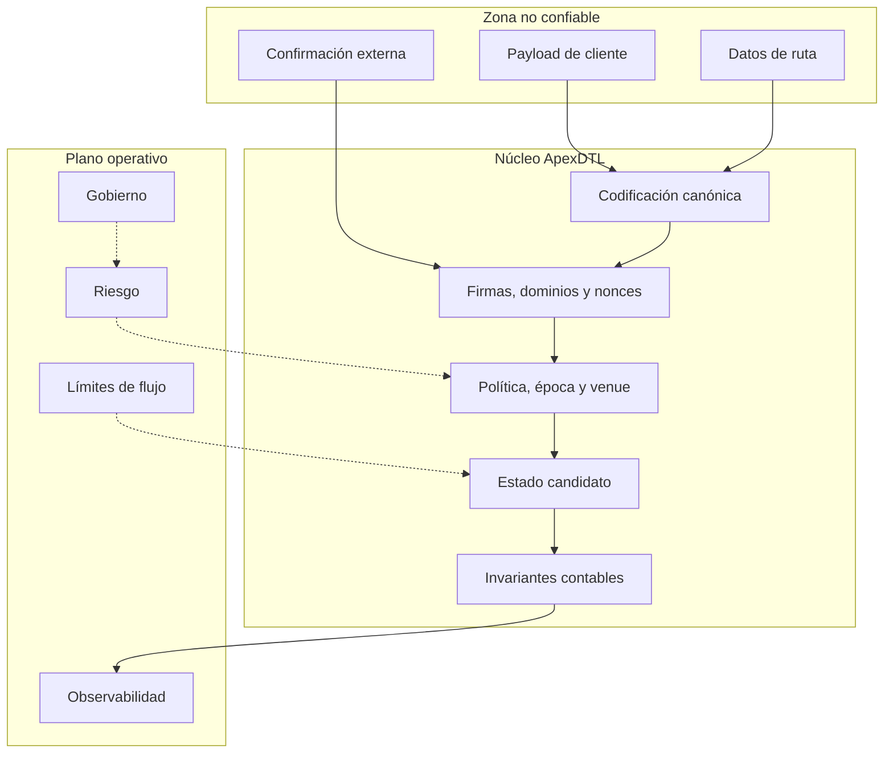
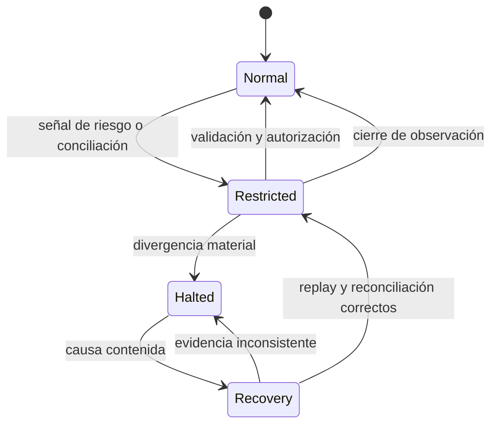

# Política de seguridad de ApexDTL

## Versiones mantenidas

| Línea | Estado | Correcciones |
| --- | --- | --- |
| `1.0.x` | Mantenida | Seguridad y compatibilidad |
| `< 1.0` | Fuera de soporte | No |

La referencia desplegable es el commit apuntado simultáneamente por la rama
`production`, el tag de la release y su objeto anotado. No se considera válida
una promoción si esos punteros divergen.

## Comunicación privada

Los informes deben abrirse mediante **GitHub Security Advisories** en la sección
Security del repositorio. No se deben publicar detalles técnicos en issues,
discussions o pull requests antes de coordinar su evaluación.

Incluye:

- commit o versión analizada;
- componente y transición afectada;
- precondiciones y secuencia mínima reproducible;
- impacto sobre autorización, disponibilidad o contabilidad;
- resultado esperado y observado;
- propuesta de contención, si existe.

El equipo confirma recepción, clasifica alcance y acuerda una ventana de
coordinación en el mismo canal privado.

## Activos protegidos

- Autorizaciones firmadas por pagador y beneficiario.
- Principal inmovilizado y saldos líquidos.
- Nonces, identificadores y conjunto de transacciones observadas.
- Política de red, activo, venue y vigencia temporal.
- Parámetros de riesgo, precio, gobierno y límites de flujo.
- Diario canónico, digests de estado y cadena de checkpoints.
- Lockfiles, pipeline de entrega y alineación de versiones.

## Límites de confianza

Todo dato recibido desde clientes, operadores o sistemas de conciliación se
considera no confiable hasta superar codificación, autenticación y política. La
observabilidad detecta divergencias, pero no sustituye las validaciones del
nucleo.

## Invariantes principales

1. El suministro observado es la suma de saldos líquidos y principal pendiente.
2. Una transición aceptada consume exactamente el nonce esperado.
3. Un identificador de transacción no puede consumirse dos veces.
4. La ruta observada debe coincidir con la comprometida por el pagador.
5. Red, activo, venue y época deben pertenecer a la política autorizada.
6. La época del ledger y de los límites móviles solo puede avanzar.
7. Un checkpoint compromete estado, diario, época, versión y predecesor.
8. Las operaciones aritméticas fallan de forma cerrada ante overflow o underflow.

## Controles preventivos

### Separación criptográfica

Las firmas de apertura y liquidación usan dominios distintos. Las vistas de
autorización incluyen los datos relevantes para su transición, evitando que una
firma válida para una acción sea reinterpretada con otro significado.

### Estado candidato

Las mutaciones del ledger se ejecutan sobre una copia. El nuevo estado solo
reemplaza al anterior después de verificar la conservación. Cualquier error deja
intactos balances, nonces, diario e intents.

### Ventanas temporales

Cada política declara una época inicial y final. El ledger rechaza ventanas
invertidas, órdenes prematuras, órdenes expiradas y retrocesos de época. Los
límites móviles aplican la misma monotonicidad.

### Gobierno

Riesgos y Operaciones pueden proponer; Risk Council y Guardian aportan peso de
aprobación; Executor ejecuta tras el timelock. Guardian conserva una ruta de
cancelación independiente. Los roles obligatorios y el quorum se verifican al
crear la configuración.

### Flujo operativo

El control de flujo aplica máximo por operación, máximo acumulado por ventana y
umbral de aprobaciones para operaciones grandes. El modo restringido reduce el
límite individual; el modo detenido conserva únicamente acciones protectoras.

## Controles detectivos

- Digests deterministas para comparar ejecuciones independientes.
- Diario inmutable en orden de aceptación.
- Checkpoints encadenados con secuencia y versión.
- Contratos CLI verificados desde Rust y JavaScript.
- CI en MSRV y Rust estable.
- Validación de tag, manifest, paquete y constante de versión.
- Dependabot semanal para Cargo, Bun y GitHub Actions.

## Matriz de amenazas

| Amenaza | Prevención | Evidencia |
| --- | --- | --- |
| Replay de apertura | nonce y `tx_id` consumido | diario y tests de escenario |
| Sustitución de ruta | digest dentro de la autorización | error `RouteDigestMismatch` |
| Venue no autorizado | enlace política-ruta | test de guardas de política |
| Orden fuera de vigencia | época monotónica y ventana | tests temporales |
| Firma reinterpretada | dominios separados | bytes canónicos firmados |
| Desbordamiento | aritmética checked | error tipado y rollback |
| Exceso de concentración | admisión posterior a operación | `AdmissionDecision` |
| Flujo anómalo | límites por operación y ventana | `FlowRecord` y modo |
| Cambio unilateral | quorum, timelock y roles | historial de propuesta |
| Deriva de estado | digest y checkpoint encadenado | `checkpoint_digest` |

## Respuesta operativa

Ante una señal:

1. Capturar versión, `state_digest`, último checkpoint y época.
2. Cambiar el modo de flujo según severidad sin reescribir evidencia.
3. Comparar diario y checkpoint con una réplica independiente.
4. Delimitar corredor, identidades, transacciones y ventana temporal.
5. Preparar corrección y regresión con lockfiles congelados.
6. Promover mediante PR, CI, rama `production`, tag anotado y release.
7. Conservar el informe y los digests de antes y después.

El runbook ampliado está en [docs/operaciones.md](./docs/operaciones.md).

## Gestión de claves

ApexDTL verifica identidades públicas, pero la generación, custodia, rotación y
revocación de material privado pertenecen a la infraestructura integradora. Se
recomienda aislamiento por entorno, firmas con contexto visible, rotación
documentada y prohibición de reutilizar seeds entre roles.

## Dependencias y cadena de entrega

- `Cargo.lock` y `bun.lock` son obligatorios.
- Las dependencias se instalan en modo congelado.
- Ninguna promoción se construye desde un árbol con cambios pendientes.
- Los tags de versión son anotados y apuntan al mismo commit que `production`.
- Las credenciales no se almacenan en el repositorio ni en salidas del CLI.

## Exclusiones operativas

La política del repositorio no cubre custodia externa de claves, consenso entre
nodos, configuración del sistema operativo, infraestructura cloud ni contratos
de terceros. Sus garantías deben evaluarse en los controles del entorno que los
opera.
