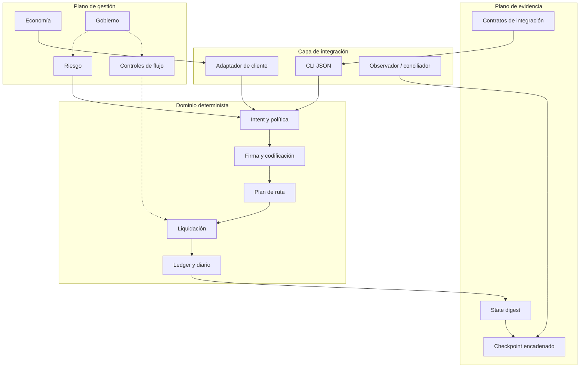
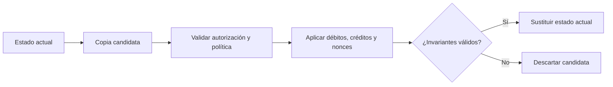
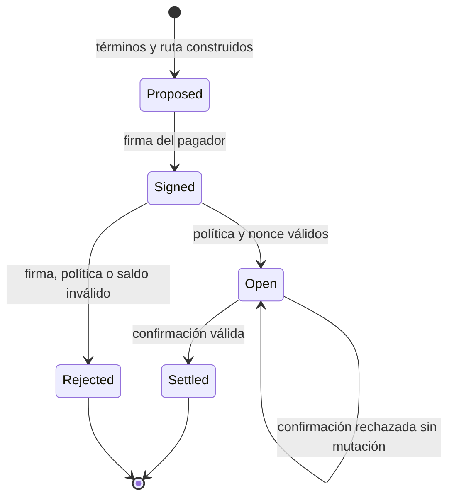

# Arquitectura de ApexDTL

## Objetivo

ApexDTL separa autorización, política, contabilidad y operación para que una
orden pueda reproducirse a partir de entradas explícitas. El núcleo no consulta
red, reloj de pared ni almacenamiento externo durante una transición. La época,
las identidades y el plan de ruta forman parte del estado o del payload.

## Vista de componentes



## Dominios

### Importe

`Amount` encapsula unidades enteras `u128`. Las operaciones expuestas son
comprobadas y devuelven errores de dominio ante overflow, underflow o divisor
cero. `Bps` limita porcentajes a `[0, 10.000]`.

No se usa coma flotante. Un resultado fraccional se redondea hacia abajo de
forma determinista:

```text
mul_bps(x, b) = floor(x · b / 10.000)
mul_ppm(x, p) = floor(x · p / 1.000.000)
```

### Identidad y codificación

Una `PublicIdentity` enlaza cuenta y clave pública Ed25519. La cuenta se deriva
de la clave, por lo que el registro valida su consistencia. `canonical_bytes`
serializa payloads antes de firmar o derivar IDs.

Cada significado criptográfico usa un dominio explícito:

- autorización de intent;
- autorización de liquidación;
- ID de intent;
- ID de transacción;
- digest de ruta;
- digest de estado;
- checkpoint.

Cambiar el dominio requiere una migración de versión porque altera bytes, firmas
y digests.

### Orden

`IntentTerms` declara pagador, beneficiario, activo, importe, nonce y política.
`IntentPolicy` limita venue, cargo observado, profundidad de ruta y ventana de
épocas. `RoutePlan` fija operador, destino económico, metadatos y quote nonce.

La vista firmada incluye términos y ruta. El ledger no acepta una ruta distinta
después de la firma.

### Ledger

`ApexLedger` mantiene:

- cuentas registradas y saldos;
- nonces de apertura y liquidación;
- intents pendientes o liquidados;
- transacciones ya observadas;
- suministro total;
- diario de operaciones;
- época actual.

La apertura y la liquidación siguen el patrón clone-validate-commit:



### Diario y checkpoint

Cada transición aceptada añade una entrada con `tx_id` y operación tipada. El
checkpoint compromete:

```text
C_n = H(secuencia, época, state_digest, journal_digest, C_n-1, versión)
```

Esto permite a dos procesos comparar el mismo punto lógico sin intercambiar el
estado completo. Un checkpoint no coincide si cambia una cuenta, un intent, una
entrada del diario, la época o la versión.

## Máquina de estados del intent



`Open` representa principal pendiente dentro del suministro. `Settled` reparte
el valor según la ruta comprometida y marca el intent como terminal.

## Determinismo

Para una misma versión y secuencia de entradas se espera igualdad en:

- IDs de intent y transacción;
- digests de ruta, estado y checkpoint;
- saldos y nonces;
- orden del diario;
- JSON de escenario.

Las colecciones comprometidas usan estructuras ordenadas. Los seeds de los
escenarios solo producen identidades reproducibles; los integradores deben usar
generación de claves propia.

## Extensibilidad

Una integración persistente puede guardar snapshots y diario fuera del proceso,
pero debe restaurarlos conservando orden, versión y época. Una integración
distribuida debe decidir consenso antes de invocar el núcleo; ApexDTL no elige
líder ni resuelve particiones.

Las nuevas rutas deben añadir una variante tipada, incluirla en la vista de
autorización y preservar la validación de política. Los nuevos campos
comprometidos requieren un dominio de versión nuevo.
