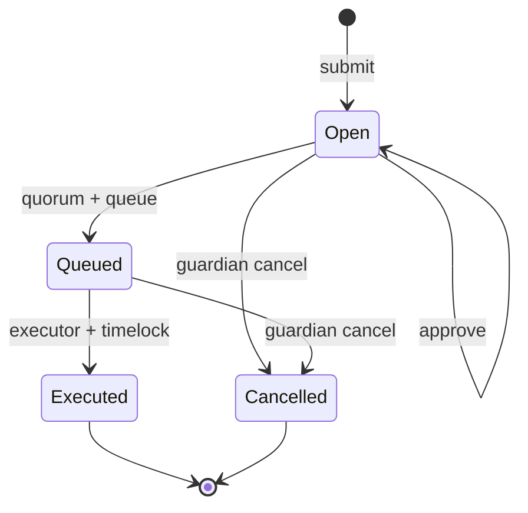
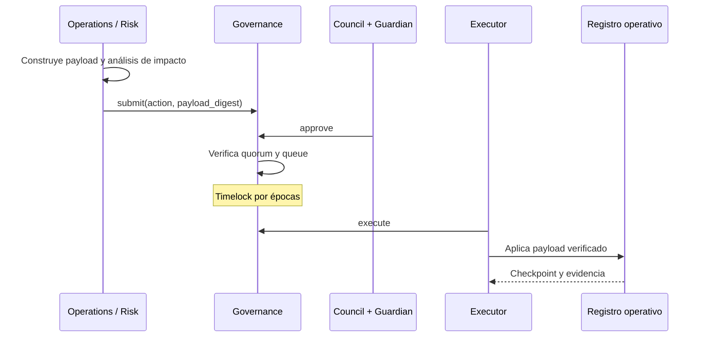

# Gobierno y parámetros

## Modelo de gobierno

El gobierno de ApexDTL usa peso explícito y separación de funciones. Una
identidad tiene un rol principal y un peso estable durante la vida de una
instancia de `Governance`.

| Rol | Proponer | Aprobar | Ejecutar | Cancelar |
| --- | :---: | :---: | :---: | :---: |
| Risk Council | Sí | Sí | No | No |
| Operations | Sí | No | No | No |
| Guardian | No | Sí | No | Sí |
| Executor | No | No | Sí | No |

La configuración exige quorum positivo, timelock positivo, expiración posterior
al timelock y presencia activa de Guardian y Executor. El peso aprobador activo
debe poder alcanzar el quorum.

## Ciclo de propuesta



El identificador de propuesta deriva de proponente, acción, digest de
justificación y época. Repetir esos elementos produce el mismo ID y se rechaza.

## Acciones soportadas

- `SetRiskProfile`: actualiza el perfil de un corredor.
- `SetFeeCurve`: actualiza parámetros de precio.
- `PauseCorridor`: detiene admisión en un corredor.
- `ResumeCorridor`: restablece un corredor tras revisión.
- `RotateMember`: enlaza una rotación con su payload aprobado.

Las acciones que contienen configuración usan `payload_digest`. El plano de
orquestación debe conservar el payload completo, verificar su digest al ejecutar
y registrar la época efectiva.

## Proceso de cambio



## Matriz de parámetros

| Familia | Parámetros | Evidencia mínima |
| --- | --- | --- |
| Riesgo | pesos, bandas, máximo y concentración | simulación antes/después |
| Colateral | mínimo por corredor | cobertura y sensibilidad |
| Precio | base, kink, pendientes, cap | curvas y contribución |
| Flujo | límites, ventana, umbral y aprobadores | replay de ventana |
| Temporal | timelock, expiración | épocas de propuesta |
| Miembros | cuenta, rol, peso, estado | continuidad de quorum |

## Reglas de seguridad

1. El proponente no debe ser el único aprobador material.
2. El executor no interpreta parámetros; aplica el payload cuyo digest fue
   aprobado.
3. Guardian puede cancelar, pero no ejecutar.
4. Las identidades inactivas no proponen, aprueban ni ejecutan.
5. Una aprobación solo cuenta una vez por cuenta.
6. Las propuestas expiradas no se encolan.
7. La activación se registra por época y checkpoint.
8. La rotación conserva capacidad de quorum antes de retirar al miembro anterior.

## Cambios de emergencia

La pausa de corredor puede tramitarse con prioridad, pero conserva quorum y
registro. Para una respuesta inmediata, el plano operativo puede cambiar
`FlowGuard` a `Restricted` o `Halted`; esa acción contiene el flujo mientras se
completa el gobierno del parámetro permanente.

Reanudar requiere:

- causa delimitada;
- estado reconciliado;
- pruebas de regresión;
- parámetros revisados;
- aprobaciones registradas;
- checkpoint posterior a la activación.

## Ejemplo de expediente

```text
change_id: RISK-2026-014
action: SetRiskProfile
corridor: eth-sol
effective_epoch: 18420
payload_digest: <digest>
rationale_digest: <digest>
previous_checkpoint: <digest>
post_change_checkpoint: <digest>
rollback_condition: concentration_post > approved_limit
```

Los nombres externos son metadatos operativos. El núcleo compromete digests para
evitar que una etiqueta mutable altere el significado aprobado.
