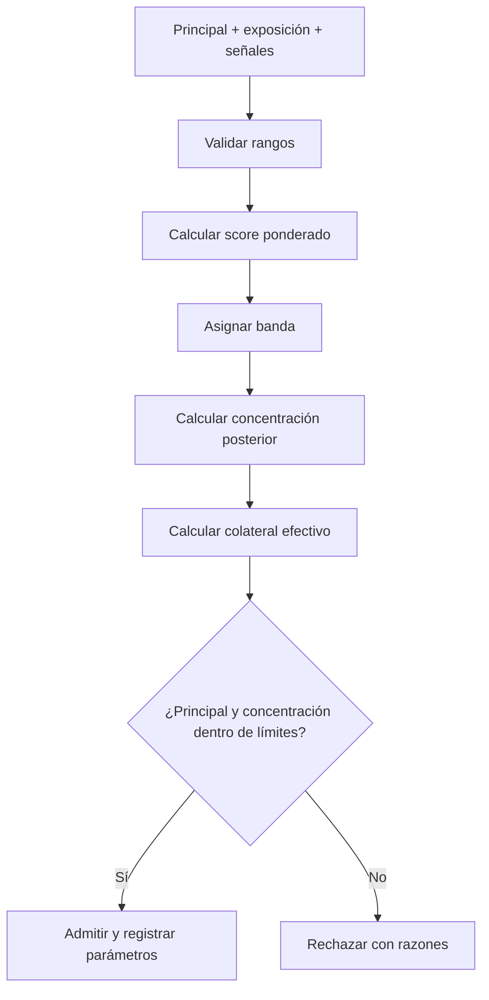

# Modelo económico

## Propósito

El modelo económico convierte riesgo, concentración, utilización y finalidad en
dos decisiones separadas:

1. **Admisión:** determina si el corredor acepta principal y cuánto colateral
   requiere.
2. **Precio:** descompone la comisión y comprueba si cubre pérdida esperada y
   coste de liquidez.

Separar ambas evita que una comisión alta convierta automáticamente una
exposición fuera de política en aceptable.

## Scoring de riesgo

Las señales se normalizan entre `0` y `10.000` bps. Un valor mayor representa
mayor riesgo.

```text
R = w_f·S_finalidad + w_l·S_liquidez + w_c·S_contraparte + w_o·S_operación
Σw = 10.000
```

La configuración por defecto usa:

| Señal | Peso |
| --- | ---: |
| Finalidad | 25 % |
| Liquidez | 20 % |
| Contraparte | 35 % |
| Operación | 20 % |

### Bandas

| Score | Banda | Colateral base |
| ---: | --- | ---: |
| `0–1.999` | Core | 100 % |
| `2.000–4.499` | Standard | 115 % |
| `4.500–6.999` | Elevated | 140 % |
| `7.000–10.000` | Restricted | 180 % |

El colateral efectivo es el máximo entre la banda y el mínimo configurado para
el corredor:

```text
ratio_efectivo = max(ratio_banda, ratio_mínimo_corredor)
colateral = floor(principal · ratio_efectivo / 10.000)
```

## Concentración posterior

La admisión evalúa el estado después de incluir la nueva operación:

```text
C_post = (exposición_corredor + principal) / (exposición_cartera + principal)
```

La operación se rechaza si el principal excede el máximo del corredor o si
`C_post` supera su límite. Esto evita aceptar una orden porque la concentración
anterior todavía estaba dentro del umbral.



## Curva de precio

La prima de utilización es lineal por tramos. Sea `u` la utilización y `k` el
kink:

```text
prima_u(u) = slope_1 · u/k                                      si u ≤ k
prima_u(u) = slope_1 + slope_2 · (u-k)/(10.000-k)              si u > k
```

La comisión efectiva es:

```text
fee_bps = min(base + prima_u + épocas_finalidad·prima_época + score/200, máximo)
comisión = floor(principal · fee_bps / 10.000)
```

La configuración por defecto define base de 8 bps, coste de liquidez de 4 bps,
kink al 80 %, pendientes de 12/80 bps y máximo de 250 bps.

## Pérdida y contribución

```text
EL = floor(principal · probabilidad_ppm / 1.000.000) · severidad_bps / 10.000
coste_liquidez = floor(principal · liquidity_cost_bps / 10.000)
reserva_riesgo = floor(EL · 1,25)
contribución = comisión - EL - coste_liquidez
```

`EconomicQuote` expone surplus y shortfall como importes separados. Nunca usa un
entero con signo, por lo que el signo económico se representa explícitamente:

- `contribution_surplus > 0`: cobertura positiva;
- `contribution_shortfall > 0`: precio insuficiente para los costes modelados.

## Ejemplo numérico

Supuestos:

| Parámetro | Valor |
| --- | ---: |
| Principal | 10.000.000 |
| Utilización | 90 % |
| Finalidad | 6 épocas |
| Probabilidad de pérdida | 2.000 ppm |
| Severidad | 40 % |
| Score | 40 % |

Con la curva por defecto:

1. prima bajo kink: `12 bps`;
2. tramo sobre kink: `40 bps`;
3. prima de utilización: `52 bps`;
4. prima de finalidad: `6 bps`;
5. prima de riesgo: `20 bps`;
6. fee total: `8 + 52 + 6 + 20 = 86 bps`;
7. comisión: `86.000` unidades;
8. pérdida esperada: `8.000` unidades;
9. coste de liquidez: `4.000` unidades;
10. contribución: `74.000` unidades.

El digest de la cotización compromete entradas, fee efectiva, importes de coste
y reserva. Dos procesos con la misma versión deben obtener el mismo digest.

## Escenarios adversos

Operaciones debe probar al menos:

- utilización inmediatamente antes, en y después del kink;
- score en cada frontera de banda;
- concentración exactamente en el límite y una unidad por encima;
- probabilidad cero y máxima;
- principal mínimo y máximo del corredor;
- fee limitada por el cap;
- horizontes de finalidad cero y máximo operativo;
- resultados con shortfall.

## Parámetros y gobierno

Cambiar pesos, límites, colateral o curva de comisión requiere una propuesta con
digest del payload. El valor completo se conserva en la configuración operativa;
el digest enlaza la decisión de gobierno con el artefacto aplicado.

Los cambios deben acompañarse de:

- comparación antes/después para corredores representativos;
- efecto sobre admisión y contribución;
- análisis de fronteras y redondeo;
- fecha de activación por época;
- plan de reversión.
