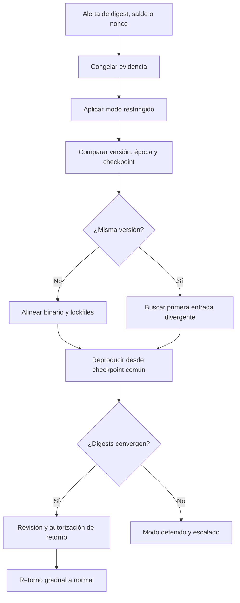
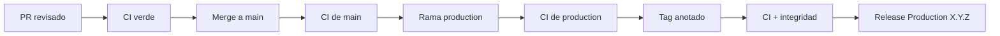

# Operaciones y respuesta

## Objetivo operativo

Operaciones mantiene continuidad entre estado, diario, configuración y release.
El criterio principal no es que un proceso responda, sino que dos observadores
independientes obtengan los mismos digests para la misma secuencia.

## Preparación

Antes de habilitar una versión:

- verificar `cargo test --all-targets --locked`;
- verificar contratos Bun;
- registrar SHA, versión y lockfiles;
- confirmar alineación entre `main`, `production`, tag y release;
- ejecutar `snapshot`, `quote` y `checkpoint`;
- archivar parámetros de riesgo, precio, gobierno y flujo;
- comprobar que existe quorum operativo y ruta de guardian.

## Señales mínimas

| Señal | Dimensión | Acción ante divergencia |
| --- | --- | --- |
| `state_digest` | Estado completo | restringir y comparar diario |
| `checkpoint_digest` | Cadena de evidencia | detener promoción |
| Época actual | Vigencia | rechazar retroceso |
| Nonce esperado | Secuencia por cuenta | investigar replay o lag |
| Intents pendientes | Principal inmovilizado | reconciliar antigüedad |
| Concentración posterior | Riesgo de corredor | bloquear admisión |
| Shortfall de cotización | Sostenibilidad | revisar curva |
| Flujo de ventana | Salidas acumuladas | restringir o detener |

## Runbook de conciliación



### Captura inicial

Registrar sin modificar estado:

```text
timestamp_observed
binary_version
git_commit
ledger_epoch
state_digest
journal_length
last_checkpoint_sequence
last_checkpoint_digest
control_mode
```

No copiar claves privadas ni payloads completos a tickets. Los identificadores y
digests permiten correlación con acceso mínimo.

### Comparación

1. Confirmar que las réplicas ejecutan el mismo commit.
2. Confirmar la misma época y secuencia de checkpoint.
3. Comparar longitud y digest del diario.
4. Localizar la primera entrada distinta.
5. Verificar bytes canónicos, dominio y versión.
6. Reproducir desde el último checkpoint común.

### Recuperación

La recuperación no edita el diario divergente. Se restaura un snapshot aprobado
y se reejecutan entradas válidas en orden. El resultado debe coincidir en estado,
diario y checkpoint antes de aceptar tráfico nuevo.

## Modos de control

### Normal

Aplica máximo individual, máximo de ventana y quorum de aprobadores grandes.

### Restricted

Reduce el máximo individual. Se usa durante degradación de un corredor,
conciliación o cambio pendiente de gobierno.

### Halted

Rechaza flujos económicos ordinarios y conserva acciones protectoras. La salida
del modo detenido exige expediente y autorización.

## Gestión de checkpoints

- Secuencia estrictamente creciente desde uno.
- Un checkpoint referencia el digest anterior.
- La época no retrocede.
- El almacenamiento externo debe ser append-only o equivalente.
- La retención debe permitir reconstruir desde un punto aprobado.
- Cada cambio de versión abre una nueva evidencia de promoción.

Frecuencia recomendada: por lote confirmado y adicionalmente antes/después de
un cambio de configuración.

## Despliegue



Si falla cualquier etapa, no se avanza a la siguiente. Una corrección produce un
nuevo commit y repite el pipeline; no se mueve un tag publicado para ocultar una
divergencia.

## Rollback

El rollback operativo selecciona una release anterior cuyo tag y rama histórica
sean verificables. El estado debe ser compatible con esa versión. Si no existe
compatibilidad directa, se aplica una migración explícita y reproducible.

Checklist:

- release objetivo y SHA;
- compatibilidad de snapshot y diario;
- parámetros activos;
- estrategia para intents pendientes;
- quorum disponible;
- checkpoint previo y posterior;
- criterio de avance de nuevo a versión actual.

## Mantenimiento

Semanalmente:

- revisar actualizaciones de dependencias;
- ejecutar CI con Rust estable;
- revisar concentración, shortfall y límites de flujo;
- comprobar continuidad de checkpoints;
- comprobar miembros activos y capacidad de quorum.

Por release:

- revisar changelog y versión;
- congelar lockfiles;
- verificar los tres punteros de entrega;
- capturar salidas `version`, `snapshot` y `checkpoint`;
- archivar evidencia de CI.
